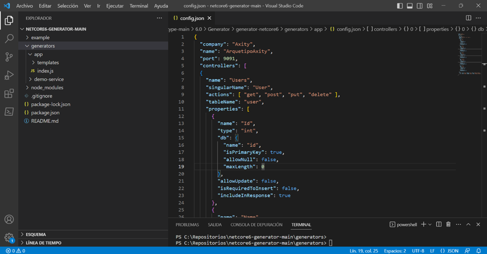

# Ficha Técnica de MINTAKA

Proyecto generado para la configuración automática de microservicios con netcore 6.0

## Requisitos

* [Instalar NodeJs LTS](https://nodejs.org/es/)
* [Instalar SDK de .NET 6](https://dotnet.microsoft.com/es-es/download)

## Configuración del Servicio

Para realizar la configuración del servicio (Compañía, Nombre, Puerto, Controladores, etc), se utiliza el siguiente archivo  ../generator-netcore6/generators/app/config.json. 

Tal como se visualiza: 



## Configurar variables de entorno

En el archivo **launchSettings.json** configure las variables de entorno para su proyecto.
```json
{
    "environmentVariables": {
        "ASPNETCORE_ENVIRONMENT": "Development", // Indicar el entorno en tiempo de ejecución
        "REDISDATA_SVC_SERVICE_HOST": "101.10.101.1", // Host para la base de redis
        "REDISDATA_SVC_SERVICE_PORT": "8080", // Puerto para la base de redis
        "MSSQL_DEPLOYMENT_SERVICE_HOST": "101.10.101.1", // Host para la base de datos
        "MSSQL_DATABASE": "Name_Database", // Nombre de la base de datos
        "MSSQL_USER": "admin", // Usuario para la base de datos
        "MSSQL_PWD": "password", // Contraseña para la base de datos
        "ASPNETCORE_URLS": "http://+:9090",
        "KAFKA_SERVICE_SERVICE_HOST": "101.10.101.1", //  Host para el servicio de Kafka
        "KAFKA_SERVICE_SERVICE_PORT": "8081", // Puerto para el servicio de Kafka
        "KAFKA_CONNECTION_STRING": "" // Cadena de conexion
      }
}
```

## Configuración de Datos de Conexión Sql Server 

Como se especificó, se requiere de una conexión hacia la base de datos Sql Server para que el método expuesto de Obtener y Crear Usuario, pueda obtener los datos. Por lo que será necesarios realizar los siguientes pasos: 

* Al ejecutar el comando yo netcore6 se crea la estructura del proyecto, por lo que se debe editar el archivo de la siguiente ruta: …generator\[nombre_servicio]-service\Axity[nombre_servicio].api\properties\launchSettings.json 

Tal como se muestra a continuación: 


* Reemplazar los datos de los siguientes campos, por los datos del servidor de Base de Datos Sql Server disponible: 

```json
   "MSSQL_DEPLOYMENT_SERVICE_HOST": "127.0.0.1", // Host para la base de datos 
   "MSSQL_DATABASE": "Temporal", // Nombre de la base de datos 
   "MSSQL_USER": "sa", // Usuario para la base de datos 
   "MSSQL_PWD": "Axity2023Test&" // Contraseña para la base de datos 
```
 
## Configuración de Datos de Conexión Redis 

Como se especificó, se requiere de una conexión hacia un servidor Redis para que el método obtener un usuario a través del identificador pueda almacenarse y devolver los datos guardados en él. Por lo que será necesarios realizar los siguientes pasos: 

* Al ejecutar el comando yo netcore6 se crea la estructura del proyecto, por lo que se debe editar el archivo de la siguiente ruta: …generator\[nombre_servicio]-service\Axity[nombre_servicio].api\properties\launchSettings.json 

Tal como se muestra a continuación: 


* Reemplazar los datos de los siguientes campos, por los datos del servidor de Redis disponible: 

```json
    "REDISDATA_SVC_SERVICE_HOST": "localhost", // Host para la base de redis 
    "REDISDATA_SVC_SERVICE_PORT": "6379" // Puerto para la base de redis  
```

## Configuración de Base de Datos Sql Server Local 

En caso de no tener un servidor de Base de Datos Sql Server, se puede instalar una imagen en un contenedor Docker, reemplazar los datos del servidor creado y ejecutar el servicio, por lo que se ejecutan los siguientes pasos: 

* Ejecutar el siguiente comando para crear el servidor Sql Server en Docker 

 ```bash
    docker run -e "ACCEPT_EULA=Y" -e "MSSQL_SA_PASSWORD=Axity2023Test&" -p 1433:1433 --name sql-server --hostname sql-server -d mcr.microsoft.com/mssql/server:2019-CU14-ubuntu-20.04 
 ```

Después de ejecutar el comando anterior, tendremos disponible el servidor: 


* Editar el archivo …generator\[nombre_servicio]-service\Axity[nombre_servicio].api\properties\launchSettings.json con los datos del servidor que se configuró. 

* Crear la Base de Datos que se utiliza en la configuración, ejecutar el siguiente  [Script](generators/app/templates/sql/CreateDataBase.sql): 

     ```bash
    generators/app/templates/sql/CreateDataBase.sql.
    ```

* Crear la Tabla que se utiliza en la consulta, ejecutar el siguiente  [Script](generators/app/templates/sql/CreateTable.sql):  

    ```bash
    generators/app/templates/sql/CreateTable.sql. 
    ```

* Insertar datos en la tabla para visualizar información, se puede ejecutar el siguiente [Script](generators/app/templates/sql/Data.sql) para comprobar que el servicio nos responde correctamente:

    ```bash
    generators/app/templates/sql/Data.sql
    ```


## Configuración de Servidor Redis Local 

En caso de no tener un servidor de Redis, se puede instalar una imagen en un contenedor Docker, reemplazar los datos del servidor creado y ejecutar el servicio, por lo que se ejecutan los siguientes pasos: 

* Ejecutar el siguiente comando para crear el servidor Redis: 

```bash
    docker run -d --name redis-server -p 6379:6379 redis/redis-stack-server:latest 
```

Después de ejecutar el comando anterior, tendremos disponible el servidor: 


* Editar el archivo …generator\[nombre_servicio]-service\Axity[nombre_servicio].api\properties\launchSettings.json con los datos del servidor que se configuró. 

---

## Generar Servicio

* Para generar el servicio e instalación de los paquetes utilizados por el mismo, se deben seguir los siguientes pasos: 

    - Extraer el repositorio en una ruta adecuada destinada para él. 
    - Abrir la carpeta en una terminal. 
    - Instalar el Yeoman, ejecutando el siguiente comando sobre la ruta ../generator-netcore6: 

```bash
    npm install -g yo 
```
Tal como se visualiza: 


* Ejecutar el siguiente comando para descargar los paquetes y dependencias, tal como se visualiza: 

```bash
    npm install
```


* Ejecutar el siguiente comando: 

```bash
    npm link
```
Tal como se visualiza: 


* Ejecutar el siguiente comando para generar el servicio, tal como se visualiza: 

```bash
    yo netcore6 
```


* Abrir la solución que se genera con el IDE Visual Studio. Dirigirse a la siguiente opción: Herramientas >> Opciones >> Administrador de Paquetes Nuget >> Orígenes del paquete. Crear un nuevo origen con los siguientes datos: 

    - Nombre: Axity 

    - Origen: https://devtools.axity.com/nexus/repository/nuget-hosted/ 

Tal como se visualiza: 


* Al realizar esta acción, se solicitarán las credenciales correspondientes para acceder al servidor, tal como se muestra: 


Por lo que para solicitar el acceso será necesario enviar un correo a los responsables del nexus:

**Gustavo Ramírez**
*[gustavo.ramirez@axity.com]*  

**Jesús Alejandro Hernández Martínez**
*[jesus.hernandezm@axity.com]*  


## Configuración con Docker

Docker automatiza el despliegue de aplicaciones dentro de contenedores.

El archivo Dockerfile contiene las instrucciones para crear la imagen.

Pasos para desplegar la aplicación:

1. **Generar imagen**

- Es necesario contar con las credenciales de acceso al nexus de axity dev tools

```sh
[nombre ingresado]-service> docker build -t nombreimagen ./ --build-arg NUGET_AUTH_TOKEN="xxxxx" --build-arg NUGET_USER_NAME="xxxxx"
```

- Obtendremos un resultado similar a esto


2. **Consultar imagen creada**

```sh
docker images
```
- Se muestra nuestra imagen , en este caso se eligió el nombre **axitydemo** 


3. **Ejecutar instancia de SQL server Express edition para pruebas locales**
- Version 2022

```sh
docker run -e "ACCEPT_EULA=Y" -e "MSSQL_SA_PASSWORD=pass-elegida" -p 1433:1433 -d mcr.microsoft.com/mssql/server:2022-latest
```

- Version 2019

```sh
docker run -e "ACCEPT_EULA=Y" -e "MSSQL_SA_PASSWORD=pass-elegida" -e "MSSQL_PID=Express" -p 1433:1433 -d mcr.microsoft.com/mssql/server:2019-latest
```

 - Validamos ejecución
  `docker ps` 


4. **Validar datos de conexión DB local**

Podemos utilizar cualquier cliente SQL de su preferencia como **DBbeaver** para probar la conexión.

- **host** : localhost
- **port** : 1433
- **Database/schema**: dejar en blanco.
- **Nombre de usuario**: sa 
- **Contraseña**: La contraseña elegida.
- **Autenticación** : SQL Server Authentication

5. **Ejecutar imagen**

```sh
docker run -p 9091:9091 -e ASPNETCORE_ENVIRONMENT="Development" -e ASPNETCORE_URLS="http://+:9091" -e MSSQL_DEPLOYMENT_SERVICE_HOST="ip-de-tu-host" -e MSSQL_DATABASE="arquetiponet" -e MSSQL_USER="sa" -e MSSQL_PWD="pass-elegida" -d axitydemo
```

6. **Mostrar contenedores en ejecución**
```sh
docker ps
```

7. **Obtener los registros de un contenedor**
En caso que sea necesario podemos ejecutar el siguiente comando para visualizar los logs del contenedor.
```sh
docker container logs [containerid]
```

8. **Aplicación desplegada**
- Validar que la aplicación se esté ejecutando por el puerto 9091 http://localhost:9091/swagger/index.html

## Casos de Uso de ejemplo
MINTAKA incorpora varios casos de uso de ejemplo, al momento de correr el servicio, se puede acceder a la url: http://localhost:9091/swagger/index.html#/, donde se observan:


## Manage User

**Mintaka** dispone de la arquitectura de componentes diseñadas para implementar los métodos HTTP Consulta y Creación que serán expuestos a través del servicio.

**Descripción del Método - GET**
* **Funcionalidad:** Obtener los usuarios de la tabla 

* **Url:** Dirección Ip donde se encuentre publicado el servicio (Se utiliza localhost de prueba)  

* **Puerto:** Puerto donde se encuentre publicado el servicio (Se utiliza el puerto 9091 de prueba)  

* **Parámetros:** N/A 

* **Ejemplo:** http://localhost:9091/api/users 

* **Verbo HTTP:** GET  

* **Respuesta:** 200 OK

```json
    [
        {
            "id":1,
            "name":"Miguel",
            "active":true,
            "create":"2023-04-26T00:00:00",
            "user":"Admin"
        },
        {
            "id":2,
            "name":"Andrea",
            "active":true,
            "create":"2023-04-26T00:00:00",
            "user":"Admin"
        }
    ] 
```

**Descripción del Método - POST** 

* **Funcionalidad:** Método que permite agregar un nuevo Usuario. 

* **Url:** Dirección Ip donde se encuentre publicado el servicio (Se utiliza localhost de prueba)  

* **Puerto:** Puerto donde se encuentre publicado el servicio (Se utiliza el puerto 9091 de prueba)  

* **Parámetros:** N/A 

* **Body:** 

```json
    {
       "Name":"Ángel",
       "Active":true,
       "Create":"2023-04-26T00:00:00",
       "User":"Admin"
    }
```

* **Ejemplo:** http://localhost:9091/api/users 

* **Verbo HTTP:** POST  

* **Respuesta:** 20O OK 

```json
    {
        "id":3,
        "name":"Ángel",
        "active":true,
        "create":"2023-04-26T00:00:00",
        "user":"Admin"
    }
```

---
# Descripción de Uso

1. **Redis:** Con redis almacenamos estructuras de datos de valores de clave en memoria.
- Obtiene el valor de la clave, si la clave no existe devuelve nulo.
```csharp
var redisKey = $"List-ProjectResponseDto";
var result = await this.database.StringGetAsync(redisKey);
```
- Almacena el valor de la cadena estableciendo un tiempo de vencimiento. Si la clave ya tiene un valor, se sobrescribe.
```csharp
var redisKey = $"List-ProjectResponseDto";
var response = await this.projectFacade.GetAllAsync();
await this.database.StringSetAsync(redisKey, JsonConvert.SerializeObject(response), TimeSpan.FromHours(1));
```
2. **Operaciones a la base de datos**
  - Consulta de datos por llave primaria
```csharp
/// <inheritdoc/>
public async Task<ProjectModel> GetByIdAsync(int id, IDatabaseContext context = null)
{
    return await FunctionsDao.GetContext(this.databaseContext, context).Users
        .Where(x => x.Id.Equals(id))
        .FirstOrDefaultAsync();
}
```
  - Consulta de una lista de datos
```csharp
/// <inheritdoc/>
public async Task<IEnumerable<ProjectModel>> GetAllAsync(IDatabaseContext context = null)
{
    return await FunctionsDao.GetContext(this.databaseContext, context).Users.ToListAsync();
}
```
  - Inserción a base de datos
```csharp
/// <inheritdoc/>
public async Task<bool> InsertAsync(ProjectModel model, IDatabaseContext context = null)
{
    return await FunctionsDao.GetContext(this.databaseContext, context).InsertAsync(model);
}
```
- Inserción masiva
```csharp
/// <inheritdoc/>
public async Task<bool> BulkInsertAsync(List<ProjectModel> models, IDatabaseContext context = null)
{
    var cxt = FunctionsDao.GetContext(this.databaseContext, context);
    await ((DatabaseContext)cxt).BulkInsertAsync(models, new BulkConfig { BatchSize = BulkValue });
    return true;
}
```
3. **Kafka:** Permitir la comunicación entre servicios diferentes.
- Crear mensajes.
- Los Dto´s utilizados para los mensajes se crean en **Common/DTOs/Messages**.
```csharp
var message = new ProjectMessagesDto
{
    Message = "Example kafka",
};
await this.kafka.ProduceAsync(message, nameof(ProjectMessagesDto));
```
- Consumir mensaje.
- Los backgrounds se crean en **API/Backgrounds**.
```csharp
private async Task ProcessExecuteAsync(IServiceScope scope, CancellationToken stoppingToken)
{
    using var consumer = this.kafka.BuildConsumer("ExampleKafka", nameof(ProjectMessagesDto));
    while (!stoppingToken.IsCancellationRequested)
    {
        this.logger.LogDebug($"Example kafka task doing background work.");
        try
        {
            var consumeResult = this.kafka.Consume(consumer, stoppingToken);
            if (consumeResult == null)
            {
                await Task.Delay(1000, stoppingToken);
                continue;
            }

            consumer.Commit(consumeResult);
            var message = JsonConvert.DeserializeObject<ProjectMessagesDto>(consumeResult.Message.Value);
            this.logger.LogDebug(message.Message);
        }
        catch (Exception e)
        {
            this.logger.LogError(e, e.Message);
        }
    }

    consumer.Close();
}
```
4. **MediatR:** Es un patrón de diseño de comportamiento que reduce el acoplamiento entre los componentes de un programa haciendo que se comuniquen a través de un objeto mediador. Permitir la comunicación dentro del mismo servicio.
  - Envia de forma asincrónica una notificación.
  - Las notificaciones se crean en **Common/DTOs/Notifications/Module**.
```csharp
public IActionResult MediatR(ExapleNotification notification)
{
    _ = this.mediator.Publish(notification);
    return this.Ok(notification);
}
```
5. **Logs:** Nos permiten detectar y analizar errores en eventos.
```csharp
this.logger.LogDebug($"Example.");
```
6. **Paquetes:** Paquetes disponibles para implementar en proyectos ASP.NET Core.
    - **Azure Storage:** Paquete con funciones comunes para implementar Azure Storage.
    - **Kafka:** Paquete con funciones para implementar Kafka.
    - **Payments:** Paquete con funciones de métodos de pago.
    - **Common:** Paquete con funciones comunes o genéricas para un proyecto.
    
---

## Capas del proyecto

1. **Api:** Se manejan únicamente controladores y configuración.
2. **Facade:** Orquestador de servicios, en esta capa se utiliza la menor lógica posible y solo se manda llamar la capa de servicios.
3. **Services:** Integración de servicios a terceros, reglas de negocio y llamados hacia DAO.
4. **Persistence:** Se encuentra el DAO, contexto para base de datos.
5. **Model:** Marco de mapeo relacional para acceder a base de datos.
6. **Common:** En esta capa se encuentran dtos, excepciones, enums y objetos que puedan ser reutilizados en todo el proyecto.
7. **Test:** Capa para pruebas unitarias (TDD).

## Colaboradores

**Hugo Meraz**  
*[hugo.meraz@axity.com]*  
**Jesus Alejandro Hernandez Martinez**  
*[jesus.hernandezm@axity.com]*  
**Pamela Jocelyn Rivera Gil**  
*[pamela.rivera@axity.com]*  
**Ingrid Mendoza Cabrera**  
*[ingrid.mendoza@axity.com]*  

## Licencia

[MIT](https://opensource.org/licenses/MIT)


### Este ARTE forma parte del CReA de Axity, para más información visitar [CReA](https://intellego365.sharepoint.com/sites/CentralAxity/M%C3%A9xico/Consultoria/Arquitectura/SitePages/CReA.aspx)